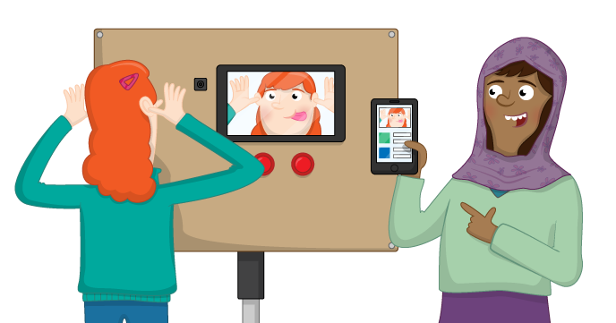

# The All-Seeing Pi

In [this resource](https://projects.raspberrypi.org/en/projects/the-all-seeing-pi), you will make a tweeting touchscreen photo booth using a Raspberry Pi.

## Licence

Unless otherwise specified, everything in this repository is covered by the following licence:

***The All-Seeing Pi*** by the [Raspberry Pi Foundation](http://www.raspberrypi.org) is licenced under a [Creative Commons Attribution 4.0 International License](http://creativecommons.org/licenses/by-sa/4.0/).

Based on a work at https://github.com/raspberrypilearning/the-all-seeing-pi
