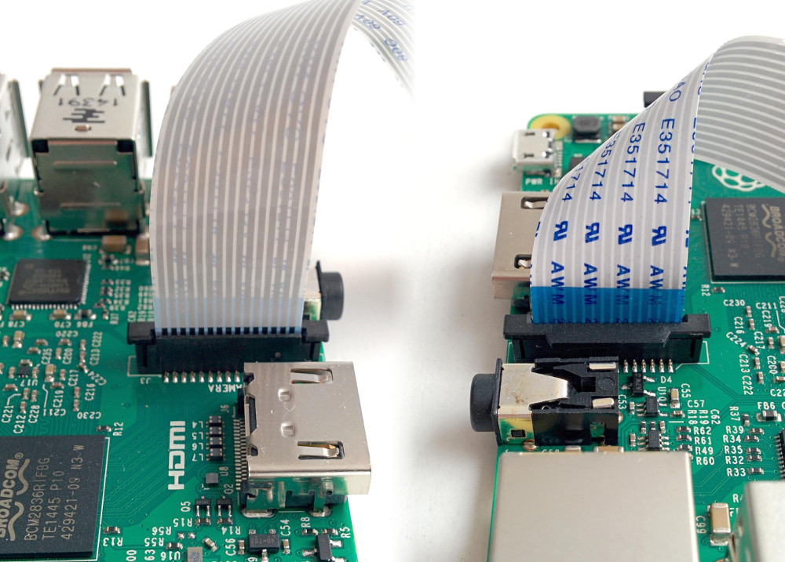

## Connecting the Camera Module

- Connect the Camera Module to the Raspberry Pi with the blue side of the connector facing the USB ports:

  

- Situate the Camera Module in your chosen housing. If you are using glue to secure it in place, be careful not to get any glue onto the connectors or camera components or they may stop working.

