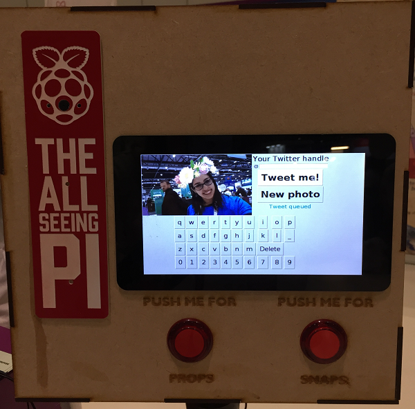

## Connecting the buttons

- Using jumper leads, wire one button to **GPIO 23** and any ground pin, and the other button to **GPIO 25** and any ground pin.

- Situate the buttons in your chosen housing. In the software, the button connected to GPIO 23 will select the next overlay, and the button connected to GPIO 25 will take the picture. (Don't worry if you accidentally wire your buttons up the other way around: you can simply swap the pin numbers in the code!)

    

