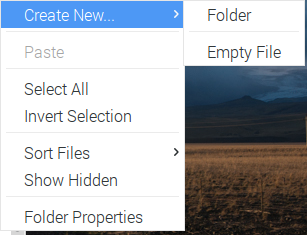
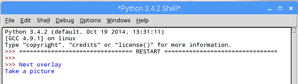
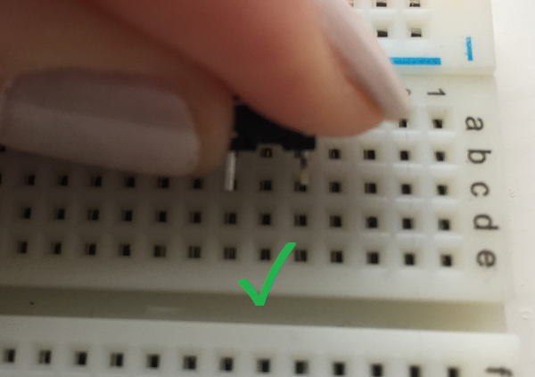

## Test the buttons

- To begin, open the **File Explorer**, then right click on a blank space inside the File Explorer window.

    

- Select **Create New** and then click **Folder**. 

    

- Type in the name of the folder where you will store the code and the photographs. We chose to call ours `allseeingpi`. Double click on the `allseeingpi` folder and make a note of the path to it (this is displayed in the bar at the top), which should be `/home/pi/allseeingpi`.

- From the **Programming** menu, open up **Python 3**.

    

- Create a new Python file by clicking on **File > New File**.

- Click on **File > Save** and save your file into the `allseeingpi` folder you just created, with the filename `allseeingpi.py`.

- We will need the `gpiozero` library. At the start of your Python file, add an import statement:

    ```python
    from gpiozero import Button
    ```

- Next we will set up the buttons. In a previous section, we wired our buttons to GPIO 23 and GPIO 25. Let's go ahead and set both buttons up.

    ```python
    next_overlay_btn = Button(23)
    take_pic_btn = Button(25)
    ```

- Now we will use gpiozero to tell the buttons what to do when pressed. In the code below, `next_overlay` and `take_picture` are functions which will be called when the corresponding button is pressed:

    ```python
    next_overlay_btn.when_pressed = next_overlay
    take_pic_btn.when_pressed = take_picture
    ```

- We will write these two functions so that the buttons know what to do when they are pressed. Functions are usually written at the start of a program, immediately after the import statements. Add the following two functions immediately after the import statement, with some placeholder code to print a message when they are pressed, so we can test them.

    ```python
    def next_overlay():
        print("Next overlay")

    def take_picture():
        print("Take a picture")
    ```

- Press **F5** to run your program. Try pressing each button and check that a different message pops up for each in the Python shell.

    

    If your buttons do not produce this result, check that they are wired up correctly, and that they are connected to GPIO pins 23 and 25 on the Raspberry Pi. The button pins should be in **different** rows of the breadboard, like this:

    
    

    You may have buttons with two legs on each side. These should be placed across the gap on your breadboard with the jumper wires both attached into one side. Take care to ensure the jumper wires are in the same rows as the legs of the button.

    

