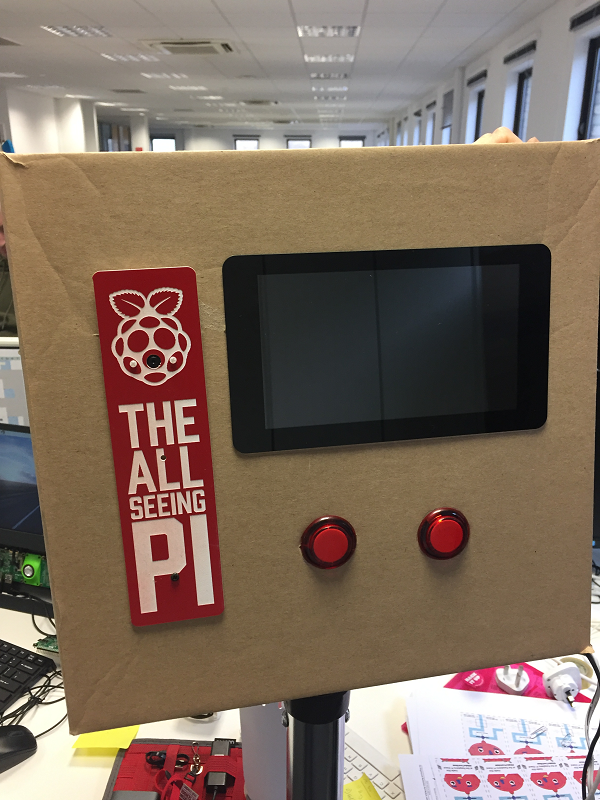
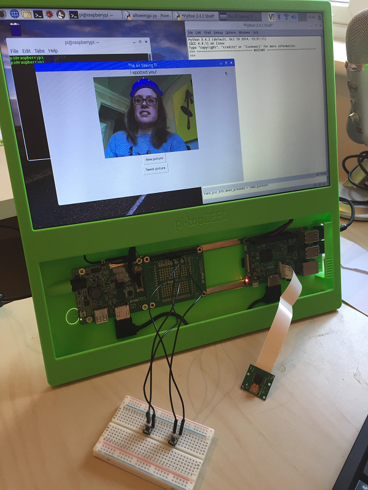

# The All Seeing Pi

In this resource you will make a tweeting touch screen photo booth using a Raspberry Pi.

## Making the photo booth housing
You can create your All Seeing Pi using any housing you like. Our first iteration used a humble cardboard box, but you might want to create a masterpiece of carpentry or laser cutting wizardry to hold your All Seeing Pi.

  

If you don't have fancy buttons or a touch screen, that's OK too - you can still make the All Seeing Pi! Here is a picture of the setup we used when creating this resource, the only extra hardware requirements are two tactile push buttons, four jumper leads and a PiCamera - you can use your usual monitor, keyboard, and mouse.

  

## Connecting the Raspberry Pi touch screen

1. Set up your Raspberry Pi touch screen. There is a [good tutorial](https://thepihut.com/blogs/raspberry-pi-tutorials/45295044-raspberry-pi-7-touch-screen-assembly-guide) available to help you. Ensure that you power the touch screen via the Raspberry Pi with jumper leads as shown in the tutorial, and that the power supply you use is a good quality one.

1. Situate your screen within the housing of your choice, ensuring you can still access the Raspberry Pi.

## Connecting the camera

1. Connect the PiCamera to the Raspberry Pi with the blue side of the connector facing the USB ports:

  

1. Situate the camera in place in your chosen housing. If you are using glue to secure the camera in place, be careful not to get any glue onto the connectors or camera components or they may stop working.

## Connecting the buttons

1. Using jumper leads, wire up one button to pin 23 and any ground pin, and the other button to GPIO 25 and any ground pin.

1. Situate the buttons in your chosen housing. In the software, the button connected to GPIO 23 will select the next overlay, and the button connected to GPIO 25 will take the picture. (Don't worry if you accidentally wire your buttons up the other way around, simply swap the pin numbers in the code!)

    

## Finishing the set up

1. To write the software, you will also need to connect a keyboard and mouse to your Raspberry Pi, as well as a display if you are not using the touchscreen.

1. Power on your Raspberry Pi and check that the touchscreen works if you are using one. Once you have set up your hardware, head over to [worksheet 2](worksheet2.md) to find out how to write the software to control your All Seeing Pi.
