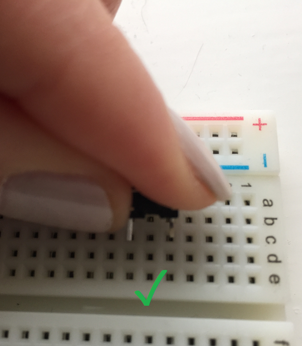
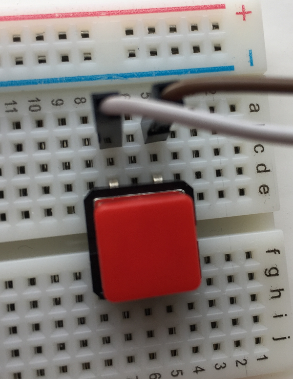
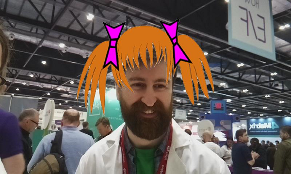
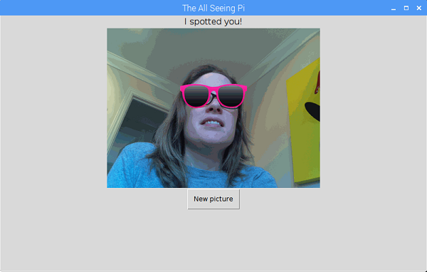
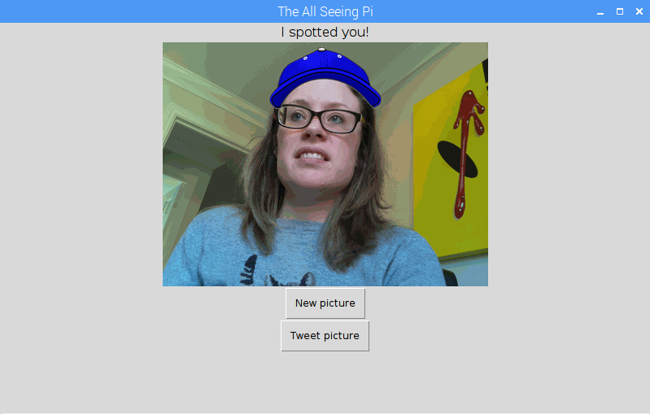
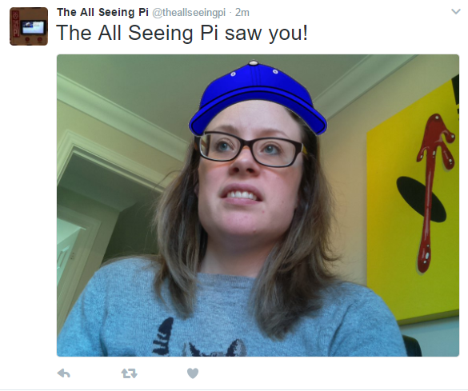

# The All-Seeing Pi Worksheet 2: Software

With the hardware set up, we can begin to program the software that will make everything work.

## Test the buttons

1. To begin, open the **File Explorer**, then right click on a blank space inside the File Explorer window.

    

1. Select **Create New** and then click **Folder**. 

    

1. Type in the name of the folder where you will store the code and the photographs. We chose to call ours `allseeingpi`. Double click on the `allseeingpi` folder and make a note of the path to it (this is displayed in the bar at the top), which should be `/home/pi/allseeingpi`.

1. From the **Programming** menu, open up **Python 3**.

    

1. Create a new Python file by clicking on **File > New File**.

1. Click on **File > Save** and save your file into the `allseeingpi` folder you just created, with the filename `allseeingpi.py`.

1. We will need the `gpiozero` library. At the start of your Python file, add an import statement:

    ```python
    from gpiozero import Button
    ```

1. Next we will set up the buttons. On the [previous worksheet](worksheet.md), we wired our buttons to GPIO 23 and GPIO 25. Let's go ahead and set both buttons up.

    ```python
    next_overlay_btn = Button(23)
    take_pic_btn = Button(25)
    ```

1. Now we will use gpiozero to tell the buttons what to do when pressed. In the code below, `next_overlay` and `take_picture` are functions which will be called when the corresponding button is pressed:

    ```python
    next_overlay_btn.when_pressed = next_overlay
    take_pic_btn.when_pressed = take_picture
    ```

1. We will write these two functions so that the buttons know what to do when they are pressed. Functions are usually written at the start of a program, immediately after the import statements. Add the following two functions immediately after the import statement, with some placeholder code to print a message when they are pressed, so we can test them.

    ```python
    def next_overlay():
        print("Next overlay")

    def take_picture():
        print("Take a picture")
    ```

1. Press **F5** to run your program. Try pressing each button and check that a different message pops up for each in the Python shell.

    

    If your buttons do not produce this result, check that they are wired up correctly, and that they are connected to GPIO pins 23 and 25 on the Raspberry Pi. The button pins should be in **different** rows of the breadboard, like this:

    
    

    You may have buttons with two legs on each side. These should be placed across the gap on your breadboard with the jumper wires both attached into one side. Take care to ensure the jumper wires are in the same rows as the legs of the button.

    

## Set up the camera

1. Now that we know the buttons work, let's set up the code for the camera. First add an import statement to the existing ones at the top of the program:

    ```python
    from picamera import PiCamera
    ```

1. Locate the existing line `take_pic_btn.when_pressed = take_picture` and, below it, add the following code to set up the camera object:

    ```python
    camera = PiCamera()
    camera.resolution = (800, 480)
    camera.hflip = True
    camera.start_preview(alpha=128)
    ```

This code creates a 'PiCamera' object with the resolution set to 800 × 480, which is the resolution of the Raspberry Pi touchscreen. We also tell the camera to flip the preview horizontally (`hflip`): if we don't do this, the preview image will be mirrored, which makes it hard for people to align themselves with the overlays! We then start the preview with alpha set to `128` so that it is semi-transparent; this is in case we get an error and need to see what is happening underneath. When you are confident that your code works, you can remove the `alpha=128` to make the preview fully opaque.


## Take a picture when the button is pressed

1. Since we will probably take lots of pictures with the All-Seeing Pi, we will put the date and time at which the picture was taken within the filename to avoid a picture being overwritten each time a new one is taken. To do this, we will need the `gmtime` and `strftime` functions from the `time` library, so add this line to the other import statements:

    ```python
    from time import gmtime, strftime
    ```

1. Underneath the code to set up the camera, add the following line:

    ```python
    output = strftime("/home/pi/allseeingpi/image-%d-%m %H:%M.png", gmtime())
    ```

    This will create a variable called `output` which contains the location and filename of where the captured photo will be saved. The `%d`, `%m` (etc) characters are how we specify the time format: `%d` means the day and `%m` means the month, for example. If you would like the date format in your filename to be different, there is a full [reference guide](https://docs.python.org/2/library/time.html#time.strftime) to `strftime` available. The current date and time is provided by calling the function `gmtime()`.

1. Now let's revisit the `take_picture()` function and add some new code so that it actually takes a picture instead of just printing a message. Locate the line `def take_picture()`. Delete the line `print("Take a picture")` and in its place, add the following lines, making sure they are indented:

    ```python
    def take_picture():
        camera.capture(output)
        camera.stop_preview()
    ```

    This code captures a picture, saving it to the location we just defined in the variable `output`. It then stops the camera preview.

1. Press **F5** to run your program, then press the button to take a picture.

1. Navigate to the folder `/home/pi/allseeingpi` and check that the picture you just took has saved correctly.

## Working with overlays

1. The All-Seeing Pi is no ordinary photo booth! The second button we set up, `next_overlay_btn`, is used to change between 'overlays': these are fun pictures such as hats, beards, and glasses which appear on the screen as if you are wearing them. Here is an example of a picture taken with an overlay:

    

    You can make your own overlays, or use the ready-made ones we have provided for you to download. If you are creating your own overlays, make sure that they are saved at 800 × 480 resolution as PNG files, with the background set to transparent.

1. Create a subfolder called `overlays` within your `allseeingpi` folder, and place your overlay images inside it.

1. Navigate to the [overlays folder](https://github.com/raspberrypilearning/the-all-seeing-pi/tree/master/en/resources) of the GitHub repo for this project. Click on the filename of the overlay you would like to use, then right-click on the download link and save the image into the `overlays` folder you just created. Repeat this process until you have saved all of the overlays you would like to use.

1. Now [right-click here](code/overlay_functions.py) and save this file as `overlay_functions.py`. Make sure you save this file in your `allseeingpi` directory (where the `allseeingpi.py` script is also saved). If you would like to see a full explanation of what these functions do, or you would prefer to write them yourself, head to the [overlay functions explanation page](worksheet3.md) to find out how to do this, then resume the tutorial at the next step.

1. In the `overlay_functions.py` file, find this comment:

    ```
    # EDIT THESE VALUES ------------------------
    ```

    You will need to change this code to specify two things:
    
      - Set the `overlays_dir` to the directory where your overlays are stored. If you are following this tutorial exactly, you will **not** need to change this directory location.
      - Set the `overlays` to be a list of the filenames of the overlays (without extension), surrounded by quotes and separated by commas. For example, if you had overlay images called `rock.png`, `paper.png`, and `scissors.png`, your line of code would look like this:

    ```python
    overlays = ['rock', 'paper', 'scissors']
    ```

1. Now go back to your `allseeingpi.py` program. Underneath the other import statements in your program, add another one to import this file:

    ```python
    from overlay_functions import *
    ```

  This will allow us to use all of the overlay functions defined in the `overlay_functions.py` file from within our `allseeingpi.py` file.

## Change overlays with a button

1. The other button you wired up to your All-Seeing Pi (called `next_overlay_btn`) will be the one we use to switch between the various overlays. Locate the function `def next_overlay():` and delete the indented line `print ("Next overlay")`. In its place, add the following code, making sure the lines are indented to show that they are part of the function:

    ```python
    def next_overlay():
        global overlay
        overlay = next(all_overlays)
        preview_overlay(camera, overlay)
    ```

    First, we have to declare that we want to use the global variable, `overlay`. This means that when we change the overlay, that value is saved so that we can access it and use it from anywhere, and the change isn't lost when we exit this function.

    The second line gets the next overlay from the list of `all_overlays` (defined within the `overlay_functions.py` file), and sets this as the current `overlay`. Then, the function `preview_overlay()` is called to display the new overlay.

1. Save your program, and run it by pressing **F5**. Check that when you press the button to change between overlays, the overlays change. Ensure you have at least one overlay image in your overlays folder to be able to change between them!

    Here is the [program so far](code/change_overlays_and_take_picture.py) if you want to check your progress.

1. You will notice that, when you take a picture, two things happen. Firstly, the overlay does not disappear and probably makes it quite difficult to see what you are doing: close the Python shell window to get rid of the overlay. Secondly, people can see a camera preview and can choose a silly hat from the overlays, but, when they take the photograph, the overlay disappears. We need to add code to remove the overlay from the screen once the picture is taken, and superimpose it onto the saved photograph.

## Save an overlay on your picture

1. Locate the function `def take_picture():` and add two lines of code at the end of the function:

    ```python
    def take_picture():
        camera.capture(output)
        camera.stop_preview()
        remove_overlays(camera)         # Add this line
        output_overlay(output, overlay) # Add this line
    ```

    Here we are using two more functions from the `overlay_functions` file. The function `remove_overlays` does exactly what it says, and removes all of the overlays so they don't hang around after we take a photograph. The `output_overlay` function takes the photograph and the overlay and glues them together so the resulting final output is a photograph with the chosen overlay superimposed.

1. Once again, save your file and run it using **F5** to check that you can now change between overlays, and that, when you take a photograph, your chosen overlay is saved as part of the picture.

## Create a GUI

We have an almost-working All-Seeing Pi. However, when a picture is taken, the camera preview disappears and the user is left staring at the Python shell and the Raspbian desktop. You probably don't want your selfie-takers to have to restart the Python program every time someone takes a picture. We will create a very simple GUI to display the picture that was taken and allow them to take another picture.

1. To create the GUI we will use a library called **guizero**, which you should have already installed in the [software installation](software.md) step. Add another import line with the others at the start of your program to bring in the guizero functions we need:

    ```python
    from guizero import App, PushButton, Text, Picture
    ```

1. At the bottom of your current program, create the beginning of your GUI.

    ```python
    app = App("The All-Seeing Pi", 800, 480)
    message = Text(app, "I spotted you!")
    app.display()
    ```

    First, we create an **app**, which is the basic container for the GUI. The dimensions are 800 × 480 because that is the resolution of the touchscreen, and the title bar will contain the text "The All-Seeing Pi". It is possible to make the GUI full-screen, but we will not do this for now because it can be difficult for testing. We also create a message, `"I spotted you!"`, and add it to the app before displaying everything.

1. Save and run your program again. Check that, when you press the button to take the photo, the camera preview exits and you see a mostly blank GUI with a message saying "I spotted you!".

1. Now, between the message line and the `app.display()` line, add another line of code to create a button.

    ```python
    new_pic = PushButton(app, new_picture, text="New picture")
    ```

    Examining the arguments passed to this `PushButton` object, we have three parts:
    
    - `app`: tells the button to add itself to the app
    - `new_picture`: this is the **command**. When the button is pushed, it will call the function `new_picture()` (which we haven't written yet!)
    - `text="New picture"`: this is the text which will appear on the button

1. Now write the `new_picture` function so that the button knows what to do when it is pressed. Write this code after the `take_picture()` function, but before the code where we set up the buttons. **Ensure that your cursor is not indented**, otherwise the code you write now will become part of the `take_picture()` function, which we do not want.

    ```python
    def new_picture():
        camera.start_preview(alpha=128)
        preview_overlay(camera, overlay)
    ```

    This function is very straightforward: it simply tells the camera to restart the preview, and to display the overlay (which will be the last overlay we used).

1. Save your program, and run it using **F5** once again. Check that you can press your physical button to take a picture, and that the GUI displays once the camera preview disappears. Check that you can press the on-screen button to restart the camera preview and take another picture.

## Stop the picture overwriting

Now that we have introduced the ability to run the program only once but take multiple pictures, we have a problem. The filename for the picture is generated by this existing line of code:

```python
output = strftime("/home/pi/allseeingpi/image-%d-%m %H:%M.png", gmtime())
```

However, we only execute this line of code once during the program. This means that, every time the button is pressed to take a picture, it is saved to the same location, with the same filename. To fix this, we need to regenerate the filename every time we take a picture.

1. Locate this line of code and copy it so you can paste it somewhere else shortly. Then, change the output to be equal to an empty string:

    ```python
    output = ""
    ```

1. Now find your `take_picture()` function. At the start of the code within the function, add the line `global output` and then paste in the line you copied. The altered function should look like this:

    ```python
    def take_picture():
        global output
        output = strftime("/home/pi/allseeingpi/image-%d-%m %H:%M.png", gmtime())
        camera.capture(output)
        camera.stop_preview()
        # .... code continues...
    ```

    We are dealing with **scoping** here: this is an important concept for programmers to understand. Why did we bother to create the variable `output` in the main part of the program, and **initialise** it as a blank string, when we could have just created it within the `take_picture()` function? The answer is that if we only created it within the `take_picture()` function, once the function finished executing, the variable would no longer exist. By declaring that we are talking about the `global` version of the `output` variable, we are telling the program that we want to use the variable `output` which we created in the main part of the program. This means that once the function exits, the variable `output` with the location of the saved picture will still exist. We need to have a permanent record where the picture was saved because it is used in other places within the program.

## Display the picture

You probably don't want your photo booth participants to have to go digging through the Raspbian filesystem to see the picture they took either, so let's display the picture they took on the GUI.

1. Locate the line of code where you intialise the `output` variable:

    ```python
    output = ""
    ```

    Immediately underneath it, add a new line of code to define the location where we will store the `latest-photo`, i.e. the photo most recently taken using the booth.

    ```python
    latest_photo = '/home/pi/allseeingpi/latest.gif'
    ```
1. Now locate the line of code where you added the `PushButton` to your GUI. Immediately **before** that line, insert a line of code to display an image on the GUI:

    ```
    your_pic = Picture(app, latest_photo)
    ```

1. The file we are referring to, `latest.gif`, does not yet exist, so if you run your program now you will not see a photograph displayed on the GUI. We must add code inside the `take_picture()` function to generate this image so that it can be displayed. Locate the `take_picture()` function and, underneath the other code in the function, add the following lines (remembering to ensure that the new lines of code are also indented):

    ```python
    size = 400, 400
    gif_img = Image.open(output)
    gif_img.thumbnail(size, Image.ANTIALIAS)
    gif_img.save(latest_photo, 'gif')

    your_pic.set(latest_photo)
    ```

    This code opens the `output` image (the image containing the photo combined with the overlay), creates a smaller thumbnail of that image in **gif** format, and saves it at the location set up in `latest_photo`. It then sets the image on the GUI (`your_pic`) to be that latest photo image using the `set()` function which is part of the guizero library.

1. Save your code and test whether, when you take a photograph, it is displayed on the GUI. You may find that there is a short delay between the camera preview exiting and the image displaying on the GUI while it is saving.

    

    You may notice that the picture quality of the image displayed on screen is not optimal. This is because the picture has been converted to gif format to be displayed on the GUI. The full-quality png version of the photograph will still be saved in the `allseeingpi` folder.

## Tweet picture

If you just want a fun photo booth to take and save pictures, you could stop there. Alternatively, you could go one step further and make your All-Seeing Pi tweet the photo that was taken.

1. You will need to set up a Twitter account and create an app for your All-Seeing Pi. Follow steps 1-4 on the [Getting started with the Twitter API](https://www.raspberrypi.org/learning/getting-started-with-the-twitter-api/worksheet/) resource in a separate file, and check that you can successfully send a textual tweet from Python.

1. Save a copy of the `auth.py` file containing your Twitter API keys (which you created during the 'Getting started' tutorial) inside your `/home/pi/allseeingpi` folder.

1. Go back to your `allseeingpi.py` file and, after the other import statements, import Twython:

    ```python
    from twython import Twython
    ```

1. Immediately after importing Twython, add the following code to import your Twitter API credentials from your `auth.py` file:

    ```python
    from auth import (
        consumer_key,
        consumer_secret,
        access_token,
        access_token_secret
    )
    ```

1. Create a new function after the `new_picture()` function, called `send_tweet()`:

    ```python
    def send_tweet():
    ```

1. Inside the function, instantiate a Twitter object:

    ```python
    def send_tweet():
        twitter = Twython(
        consumer_key,
        consumer_secret,
        access_token,
        access_token_secret
        )
    ```

1. Add some more code inside the `send_tweet()` function to tweet the `output` picture. You can change the text in your `message` code if you want your tweet to say something different:

    ```python
    message = "The All-Seeing Pi saw you!"
    with open(output, 'rb') as photo:
        twitter.update_status_with_media(status=message, media=photo)
    ```

1. Now, find the code for the GUI where you create the `PushButton` for a new picture, and add another `PushButton` underneath it which will call the `send_tweet()` function when it is pressed:

    ```python
    tweet_pic = PushButton(app, send_tweet, text="Tweet picture")
    ```

    

1. Save and run your program. Test whether, when you take a picture and press the **Tweet picture** button on the GUI, the picture is tweeted from your Twitter account.

    


The finished code is [here](code/finished_allseeingpi.py): you can check it against your code if you need to.

Once you are happy that your All-Seeing Pi works, you may wish to remove the `alpha=128` command from the camera preview to make it fully opaque. You can also make the GUI full-screen: locate the line `app = App("The All-Seeing Pi", 800, 480)` and, immediately after it, add the line `app.attributes("-fullscreen", True)`.

## What next?
- Can you add a text box or perhaps a touchscreen keyboard to your GUI to allow someone to enter their Twitter handle?
- Can you use this Twitter handle to add an `@username` mention to the tweet text?
- Could you make a more imaginative housing for your All-Seeing Pi?
